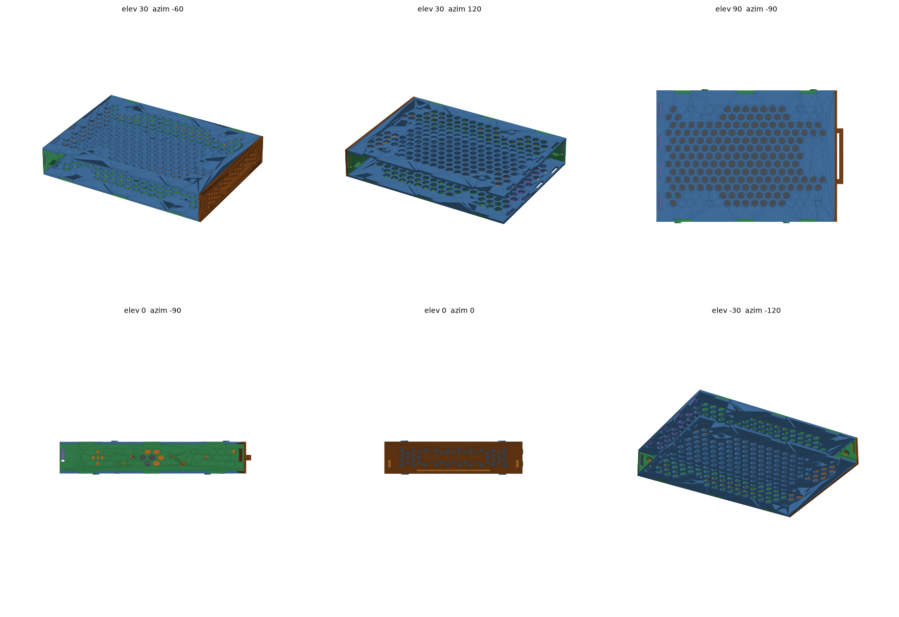
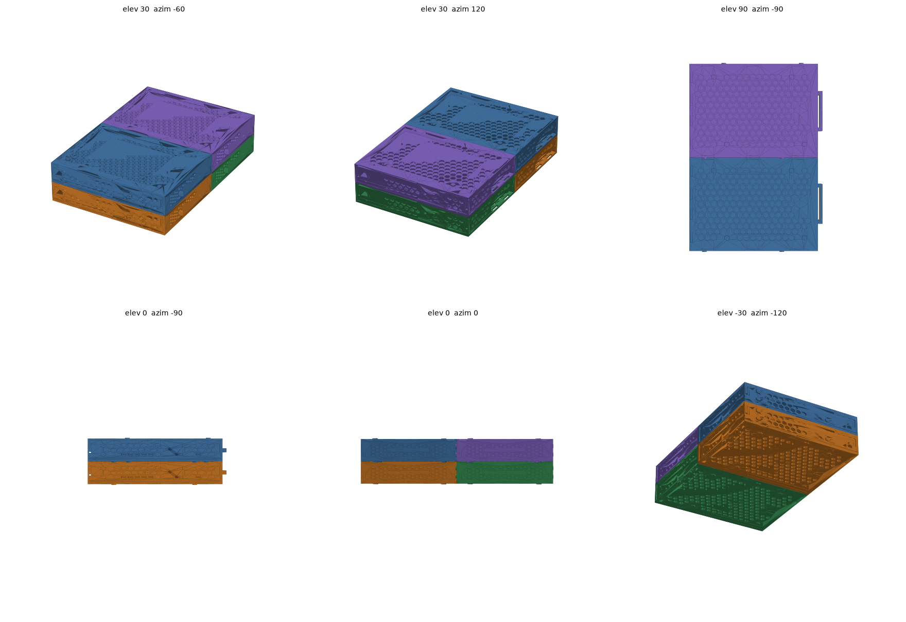

# Stackable disk bay

[](https://github.com/kisst/stackable-disk-bay/actions/workflows/checks.yml)

A 3D-printable bay and toolless caddy for 3.5" hard drives. Bays are identical
and sit on top of and beside each other, located by hex bumps that drop into
the neighbour's honeycomb, with no connector parts. The drive drops into the
caddy without screws; the caddy slides into the bay and clicks home. Every
part prints flat, no supports.



**Status: parametric model, verified by geometry checks, not yet printed.**
See [docs/design.md](docs/design.md) for the spec and what a first print has
to answer.

## Parts

| Part | File | Per bay | Print |
| --- | --- | --- | --- |
| Caddy tray | `scad/caddy_tray.scad` | 1 | flat on its floor |
| Caddy bezel | `scad/bezel.scad` | 1 | flat, front face down |
| Plate, top and bottom | `scad/plate.scad` | 1 + 1 | flat, bumps up; same shape, different engraved mark |
| Wall (left and right) | `scad/wall.scad` | 2 | flat, bumps up |
| Rear panel | `scad/rear.scad` | 1 | flat |
| Pin coupon | `scad/coupon.scad` | optional | flat |

Print the coupon first: a 50 mm slice of the caddy with one fixed pin and one
finger, to check pin diameter and finger stiffness on a real drive.

Views (not prints), all in `out/` after a render:

| Image | Shows |
| --- | --- |
| `assembled.png` | one assembled unit, every printed part plus the drive |
| `testfit.png`, `testfit_open.png` | one unit with the drive and SATA plugs, one colour per part; the second with the top plate lifted off |
| `assembly_steps.png` | assembly drawing: rear panel in the bottom plate, walls to the sides, top plate above |
| `join_stack.png`, `join_side.png`, `join_detail*.png` | how bays join, exploded and close up |
| `assembly_parts.png` | the 2 × 2 combo, one colour per part class |
| `assembly_units.png` | the 2 × 2 combo, one colour per bay |



Every part has an orientation mark: a low groove round both walls and the
rear panel that must line up, and an arrow engraved on each plate's bump
face pointing to the front. The bottom plate's arrow has a bar under it.
`scad/hdd.scad` is the reference drive and `scad/sata_plugs.scad` the mated
cable plugs used for the rear cutout check.

## How it works

- **Drive in caddy.** Two fixed pins on one wall, two pins on 45° cantilever
  fingers on the other. Tilt the drive onto the fixed pins, press the other
  edge down, the fingers flex out and the pins snap into the drive's side
  holes. The fingers are diagonal so their slots print without support; the
  recessed tip gives a fingernail purchase to release.
- **Caddy assembly.** The bezel presses onto tabs on the tray's walls and
  floor; glue is optional.
- **Caddy in bay.** Slide it in until the bezel seats on the bay's front face.
  Two spring bumps on the caddy click into two holes in the bay wall; their
  spacing means one is always on a honeycomb web while the other crosses a
  cell, so there are no false clicks on the way in. Pull the handle to remove.
- **Bay assembly.** Rear panel into the bottom plate; walls slid in from the
  sides, lifted one plate thickness, then dropped; top plate on. The panel's
  open corner clears the SATA plugs. Glue is optional. A set of checks proves
  the insertion path.
- **Bay to bay.** No extra parts. Every bump stands on its part's honeycomb
  lattice, offset so that the same part turned for the opposite face presents
  an open cell where each bump arrives: plates turned over for stacking,
  walls turned end for end for side by side. Set a bay on top or beside,
  arrows the same way, done. Bumps locate, they do not lock: glue them if a
  block must lift as one.
- **Airflow.** Honeycomb through plates, walls, caddy floor and bezel, inside
  solid rims that carry the load.

## Tooling

Needs Docker and a stock `python3` (standard library only). OpenSCAD
(`openscad/openscad:2021.01`) and the preview renderer run in containers.

```sh
scripts/render.sh          # STL + PNG for every part and view -> out/
scripts/check.sh           # all interference checks; all must PASS
scripts/check.sh quick     # single unit and neighbours only
scripts/check.sh array     # loaded 2x2 combo only (slow, CGAL)
scripts/check.sh only a b  # the named checks only
scripts/thin.sh            # no part has material under 0.8 mm (two perimeters)
scripts/vent.sh            # caddy floor and bay plate honeycombs line up
```

`scripts/check.sh` intersects pairs of bodies and asserts the result is empty
(a face-to-face touch passes, a volume fails), or, for the hold checks, that a
displaced part hits material: tabs shifted in their slots, neighbours shifted
along the bay into the bumps. `scripts/thin.sh` slices every part in its print orientation,
opens each slice by 0.4 mm and fails on whatever the opening removed, unless
it is only the tail of a slice grazing a sharp corner.

GitHub Actions runs `check.sh`, `thin.sh` and `vent.sh` on every push and
pull request, and builds the printable STLs as a downloadable artifact.

## Layout

```text
scad/       params.scad lib.scad hdd.scad sata_plugs.scad caddy.scad bay.scad      shared model
            caddy_tray.scad bezel.scad plate.scad wall.scad rear.scad coupon.scad  printable parts
            testfit.scad assembly.scad joining.scad                                views
            checks.scad thin.scad vent.scad                                        verification
scripts/    render.sh check.sh thin.sh vent.sh preview.py stl_components.py stl_bbox.py
docs/       design.md adr/ img/
out/        build output (ignored)
```

## License

[MIT](LICENSE)
