# Assembly

One bay and one caddy per drive. Every part prints flat with no support; see
the parts table in the [README](../README.md). Glue is never required: the
tabs are friction fits. A drop of glue on the bay's tabs makes it permanent.

Colours in the pictures: plates blue, walls green, rear panel purple, caddy
tray orange, bezel brown, drive grey.

## Bay

### 1. Walls onto the rear panel

Hold the panel with its low groove on the outside and the open corner at
the bottom, on the same side as the drive's SATA connector: on the left,
seen from behind. Slide each wall
sideways onto the panel's side tab, low groove on the outside and near the
floor. Either end of a wall may face the rear. Panel and walls now stand
as a U.

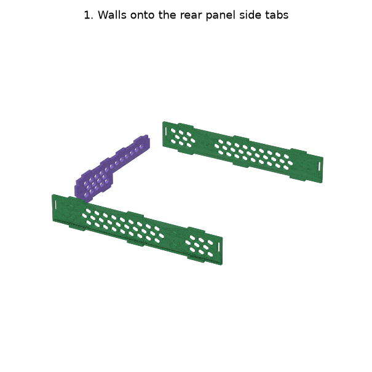

### 2. Into the bottom plate

Take the plate with **two** slots, bumps down, slots at the rear. Lower
the U onto it: the walls' three bottom tabs and the panel's two bottom tabs
all drop into their slots together.

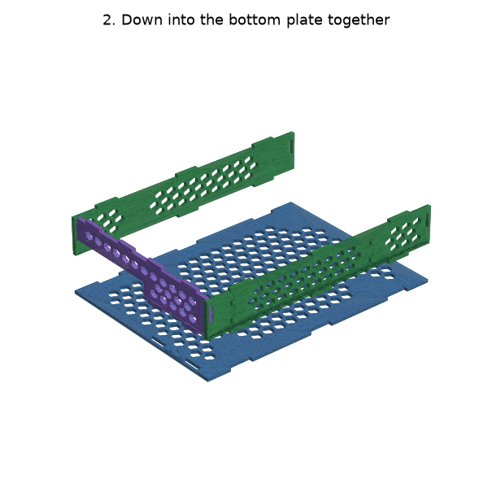

### 3. Top plate on

Take the plate with **six** slots, bumps up, the row of four at the rear.
Drop it over the walls' top tabs and the panel's four top tabs. It caps
the panel's side edges.

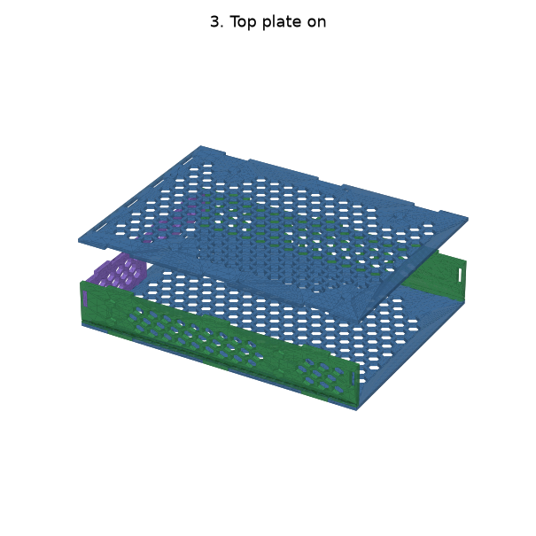

## Caddy

### 4. Bezel onto the tray

Press the bezel onto the tray's three front tabs, one on each wall and the
long one on the floor, with the finger notch at the top.

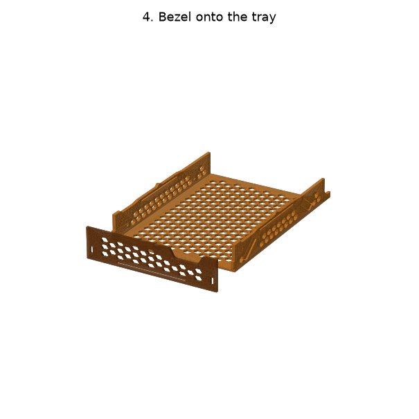

### 5. Drive into the caddy

Connector end to the rear. Tilt the drive onto the two fixed pins on the
wall without fingers, its front corner under the bezel's lip, then press
the other edge down: the two fingers flex out and their pins snap into the
drive's side holes, and the bezel gives a little as the drive passes under
the lip.

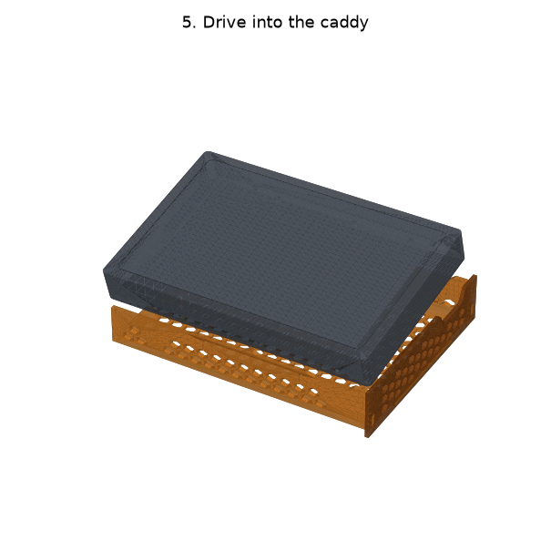

To take a drive out, put a small flat screwdriver into the hex hole at the
low end of each finger, against the finger's tip, and pry the tip outward
until its pin leaves the drive's hole. Then lift that edge of the drive.

## Into the bay

### 6. Slide the caddy in

Rear first. The spring bumps on top of the caddy walls ride under the top
plate and click into its two small slots as the bezel meets the bay.

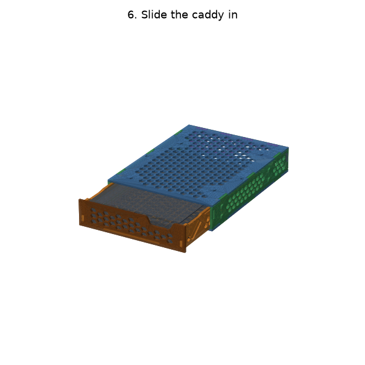

### 7. Seated, and how to get it out

Seated, the springs hold the caddy down and the bezel tight against the
bay. To remove it, pull by the notch in the bezel's top edge, or push the
tab that sticks out of the rear panel's open corner from behind.

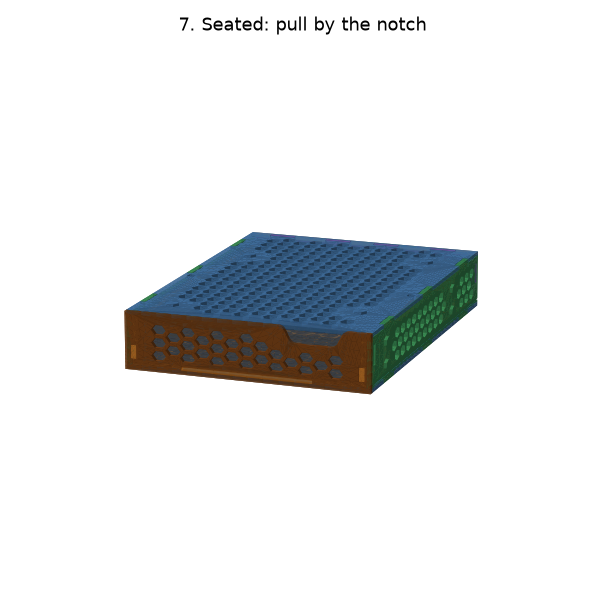

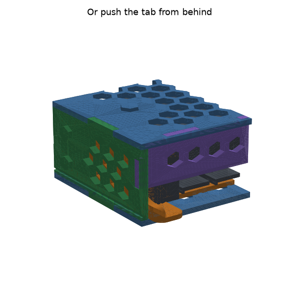

## Joining bays

Set the next bay on top, or bring it in from the side, facing the same way.
The bumps drop into the neighbour's honeycomb cells; no extra parts. Bumps
locate, they do not lock: glue them if a block must lift as one.

## Accessories

### 2.5" drive in an adapter

The adapter takes the place of a 3.5" drive in an ordinary caddy. Hang the
2.5" drive on the two pins of the adapter's long rail, connector end to the
rear, then press its other side down until the thin strip's pin snaps into
the drive's side hole. Put the adapter into the caddy like a 3.5" drive:
the rail side onto the fixed pins first, then press the strip side down
past the fingers. The drive's SATA connector comes out of the rear panel's
open corner where a 3.5" drive's would.

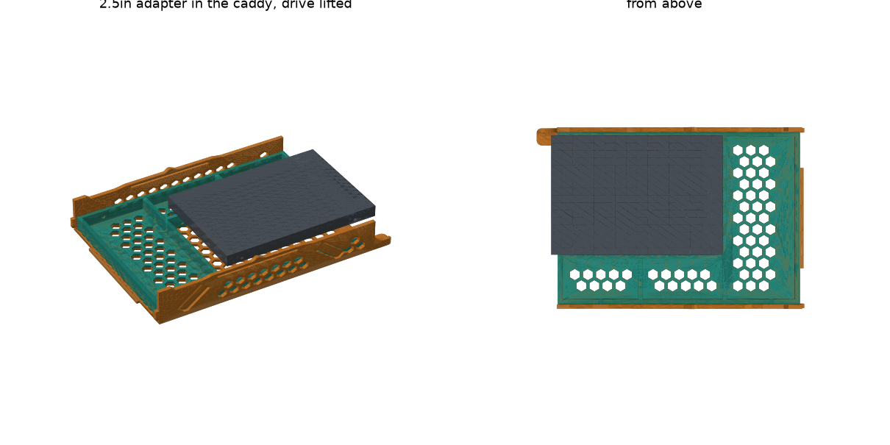

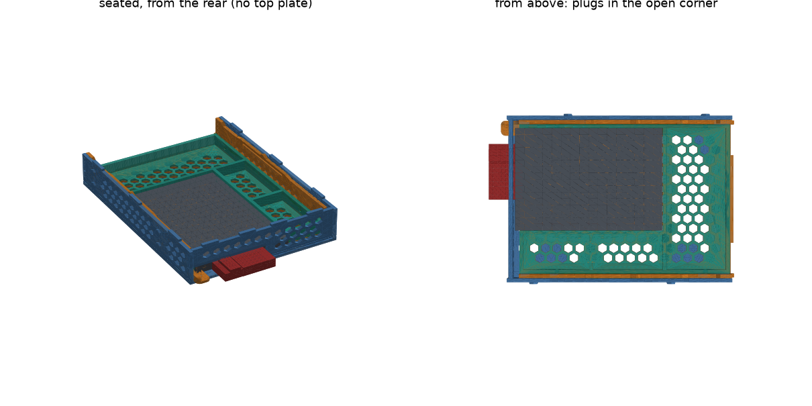

### Feet

Press four feet into the bottom plate of the lowest bays, near the
corners. Each foot's three pins go into three neighbouring open cells: two
in one row, one in the next row between them.

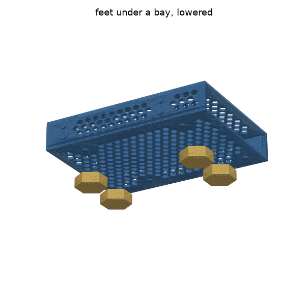

### Joiner plates

Lay a joiner on a bay's top plate, or against its side wall, and set the
next bay on it, facing the same way. The bumps of both bays drop into the
joiner's holes. Slide pieces together along their dovetails before laying
them. Over two columns or rows, use 0.5 + 1 + 0.5, so the seams fall at
mid-bay and tie the bays together; on a single bay, use 0.5 + 0.5, the
second half turned round. For four rows side by side, 0.5 + 3 + 0.5.
Use joiners in one direction per block: between
layers, with the columns touching, or between columns, with the layers
touching.

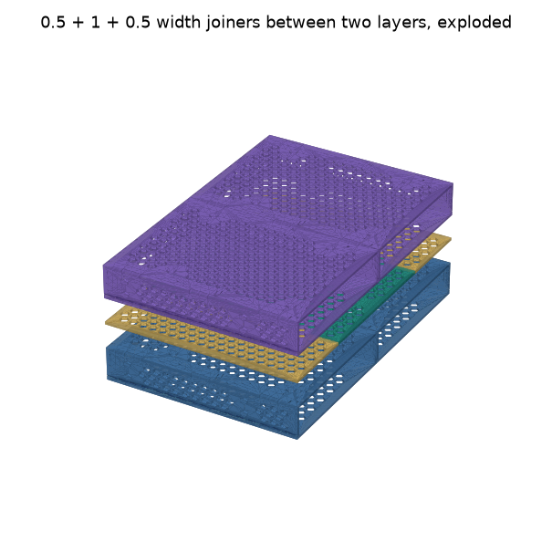

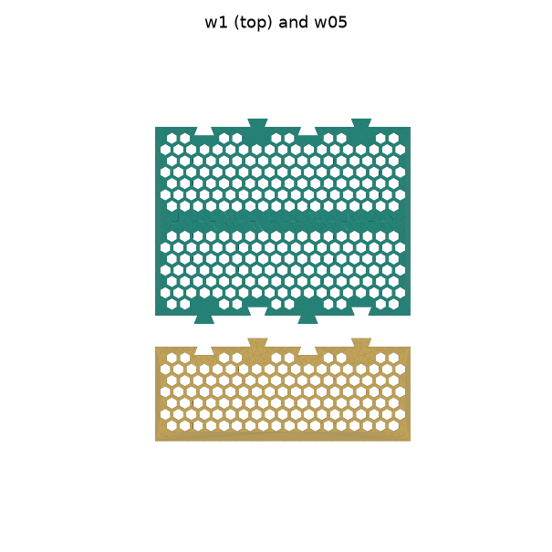

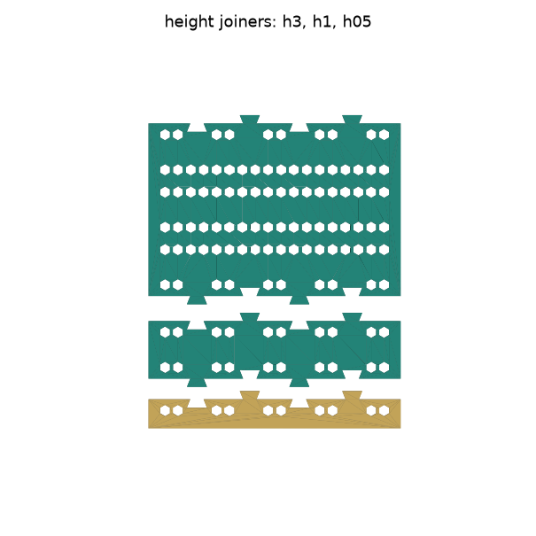
